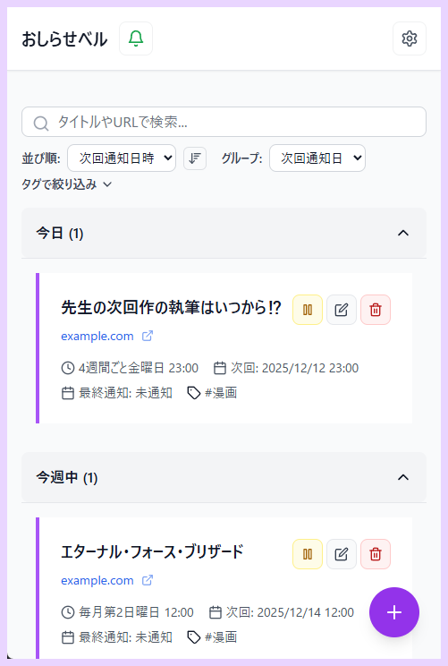
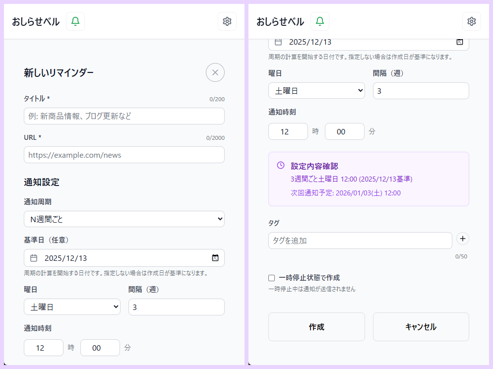

# 🔔「おしらせベル」introduction

ようこそ。 
毎日のWeb巡回で指紋をすり減らしている、愛すべきインターネット・ジャンキーの皆様。

「あの漫画、更新されてるかな…（F5ｯﾀｰﾝ）」 
「あのブログ、新しい記事出たかな…（画面を下にスワイプ）」 
「おっと、更新されてなかった。また明日来よう（徒労）」

人生は短く、Webコンテンツは無限です。リロード操作に費やしている暇などないのです。 
というわけで、私たちが本来やるべき「コンテンツの摂取」に専念するためのツール、**「おしらせベル」** をここに置いておきます。

 
_▲ アプリのメイン画面_

---

## 📡 これは何？

指定したURLを、指定したスケジュールでお知らせするだけのWebアプリ（PWA）です。 
それ以上でもそれ以下でもございません。

### 📅 細やかなスケジュール設定が可能

「毎日」「毎週」だけではとても足りません。 
「3日ごと」や「毎月第2・第4金曜日」という、不定期連載にも対応させておきました。

 
_▲ リマインダー設定画面_

### 🏃 通知タップで、即、現場へ

通知が届きましたら、それをタップするだけで目的のWebページが直接開きます。 
「通知を見て、ブラウザを開いて、ブックマークから探して……」などという手間は不要です。 
サクッと確認して、サクッと楽しんでください。

### 📱 アプリのように鎮座（PWA）

ブラウザのタブの山に埋もれさせ、アプリを見失ってしまったら、使いやすさどころの話ではありません。 
PCでもスマホでもインストールして、ホーム画面に置いてやってください。 
ネイティブアプリのような顔をして、貴方の端末に居座ります。

---

## ⚠️ 【重要】 お使いになる前に（免責）

予め申し上げておきますが、このアプリは **「正確な時間」を知るのには向いておりません。**  
仕組み上（GitHub Actionsのご機嫌次第）、通知が届くのは設定した時間から **数分～1時間ほど遅れる** ことがございます。

- ✅ **向いている用途**
  - 「今日更新されるはずの漫画」を忘れないようにする
  - 「だいたいこの辺りで発売される雑誌」をチェックする
  - 生存確認

- ❌ **向いていない用途**
  - 1分1秒を争う人気チケットの争奪戦
  - 限定グッズの先着販売
  - タイムセール

通知が遅れたことによる不利益には、私は一切関知いたしません。 
そのような用途には、別のサービスをご利用になることを強くお勧めします。

---

## 🚫 個人情報とプライバシーについて

私は、皆様の個人情報の管理責任という重荷を、極力背負いたくありません。 
ですので、**会員登録機能はございません。** IDもパスワードも不要です。 
（プッシュ通知のためにブラウザを一意に識別するIDは内部で振っておりますが、あくまで機械的な識別のためのものです。個人は特定できません）

ただし、**一つだけお願いがございます。**

サービスの性質上、不具合調査やメンテナンスの過程で、登録されたリマインダーの内容（URLやタイトル、タグ）が管理者の目に触れる機会もあります。 
ですので、**第三者に知られて困るようなURL** や、**機密情報** は登録しないでください。

---

## 🔚 終わりに

ブラウザのキャッシュをクリアするとデータが消え失せますので、気が向いた時にでも **「バックアップ（JSON書き出し）」** をしておくことを推奨します。

それでは、よきインターネット・ライフを。

---

**【今すぐ使ってみる】**  
[https://update-bell-app.vercel.app/](https://update-bell-app.vercel.app/)
